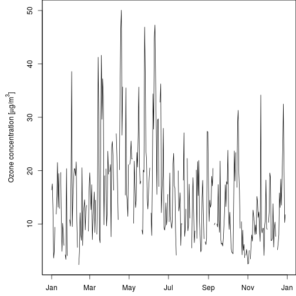
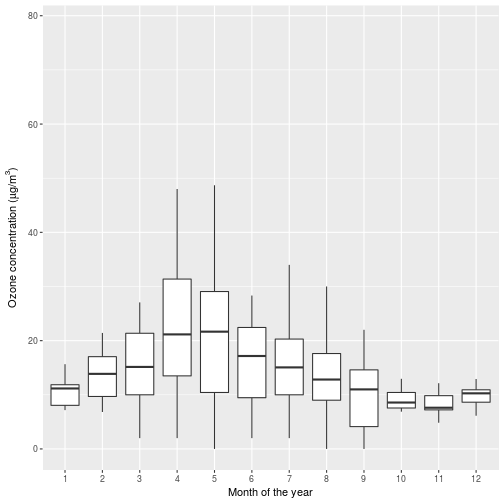
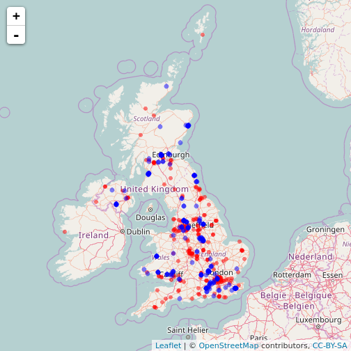
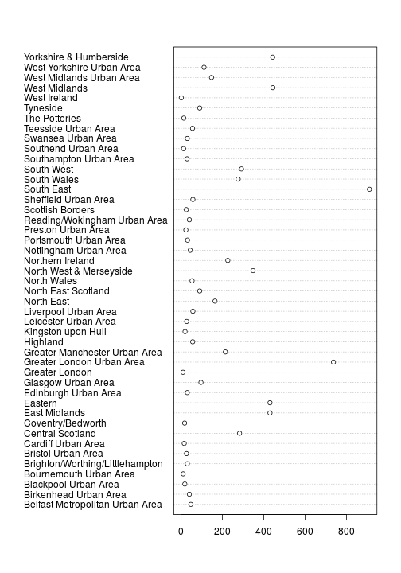
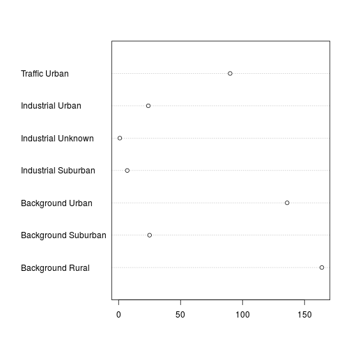

# Introduction
The package rdefra allows to retrieve air pollution data from the Air Information Resource (UK-AIR, https://uk-air.defra.gov.uk/) of the Department for Environment, Food and Rural Affairs in the United Kingdom. UK-AIR does not provide a public API for programmatic access to data, therefore this package scrapes the HTML pages to get relevant information.

This package follows a logic similar to other packages such as waterData and rnrfa: sites are first identified through a catalogue, data are imported via the station identification number, then data are visualised and/or used in analyses. The metadata related to the monitoring stations are accessible through the function `ukair_catalogue()`, missing stations' coordinates can be obtained using the function `ukair_get_coordinates()`, and time series data related to different pollutants can be obtained using the function `ukair_get_hourly_data()`.

The package is designed to collect data efficiently. It allows to download multiple years of data for a single station with one line of code and, if used with the parallel package, allows the acquisition of data from hundreds of sites in only few minutes.

## Dependencies & Installation

### Dependencies

The rdefra package depends on two things: 

* The Geospatial Data Abstraction Library (gdal). 

* Some additional CRAN packages. Check for missing dependencies and install them using the commands below:


```r
packs <- c('httr', 'xml2', 'lubridate', 'tibble', 'dplyr', 'sp', 'devtools',
           'leaflet', 'zoo', 'testthat', 'knitr', 'Rmarkdown')
new.packages <- packs[!(packs %in% installed.packages()[,'Package'])]
if(length(new.packages)) install.packages(new.packages)
```

### Installation

Get the released version from CRAN:


```r
install.packages('rdefra')
```

Or the development version from github using [devtools](https://github.com/hadley/devtools):


```r
devtools::install_github('ropensci/rdefra')
```

Load the rdefra package:


```r
library('rdefra')
```

## Functions

The package logic assumes that users access the UK-AIR database in two steps:

1. Browse the catalogue of available stations and selects some stations of interest.
2. Retrieves data for the selected stations.

### Get metadata catalogue
DEFRA monitoring stations can be downloaded and filtered using the function `ukair_catalogue()` with no input parameters, as in the example below. 


```r
# Get full catalogue
stations_raw <- ukair_catalogue()
```

The same function, can be used to filter the catalogue using the following input parameters:

* `site_name` IDs of specific site (UK.AIR.ID). By default this is left blank to get info on all the available sites.
* `pollutant` This is an integer between 1 and 10. Default is 9999, which means all the pollutants.
* `group_id` This is the identification number of a group of stations. Default is 9999 which means all available networks.
* `closed` This is set to TRUE to include closed stations, FALSE otherwise.
* `country_id` This is the identification number of the country, it can be an integer between 1 and 6. Default is 9999, which means all the countries.
* `region_id` This is the identification number of the region. 1 = Aberdeen City, etc. (for the full list see https://uk-air.defra.gov.uk/). Default is 9999, which means all the local authorities.


```r
stations_EnglandOzone <- ukair_catalogue(pollutant = 1, country_id = 1)
```

The example above shows how to retrieve the 106 stations in England in which ozone is measured.

### Get missing coordinates
Locating a station is extremely important to be able to carry out any spatial analysis. If coordinates are missing, for some stations in the catalogue, it might be possible to retrieve Easting and Northing (coordinates in the British National Grid) from DEFRA's web pages. Get E and N, transform them to latitude and longitude and populate the missing coordinates using the code below.


```r
# Scrape DEFRA website to get Easting/Northing
stations <- ukair_get_coordinates(stations_raw)
```

### Check hourly data availability
Pollution data started to be collected in 1972 and consists of hourly concentration of various species (in &#956;g/m<sup>3</sup>), such as ozone (O<sub>3</sub>), particulate matters (PM<sub>2.5</sub> and PM<sub>10</sub>), nitrogen dioxide (NO<sub>2</sub>), sulphur dioxide (SO<sub>2</sub>), and so on.

The ID under which they are available differs from the UK.AIR.ID. The catalogue does not contain this additional station ID (called SiteID hereafter) but DEFRA's web pages contain references to both the UK.AIR.ID and the SiteID. The function below uses as input the UK.AIR.ID and outputs the SiteID, if available. 


```r
stations$SiteID <- ukair_get_site_id(stations$UK.AIR.ID)
```

### Get hourly data

The time series for a given station can be retrieved in one line of code:


```r
# Get 1 year of hourly ozone data from London Marylebone Road monitoring station
df <- ukair_get_hourly_data('MY1', years=2015)

# Aggregate to daily means and plot
library('zoo')
par(mai = c(0.5, 1, 0, 0)) 
my1 <- zoo(x = df$Ozone, order.by = as.POSIXlt(df$datetime))
plot(aggregate(my1, as.Date(as.POSIXlt(df$datetime)), mean), 
     main = '', xlab = '', ylab = expression(paste('Ozone concentration [',
                                                    mu, 'g/', m^3, ']')))
```



Units are available as attribute of the `ukair_get_hourly_data()`.


```r
attributes(my1)$units
#> NULL
```

Highest concentrations seem to happen in late spring and at the beginning of summer. In order to check whether this happens every year, we can download multiple years of data and then compare them.


```r
# Get 15 years of hourly ozone data from the same monitoring station
library('ggplot2')
library('dplyr')
library('lubridate')

df <- ukair_get_hourly_data('MY1', years = 2000:2015)
df <- mutate(df, 
             year = year(datetime),
             month = month(datetime),
             year_month = strftime(datetime, "%Y-%m"))

df %>%
  group_by(month, year_month) %>%
  summarize(ozone = mean(Ozone, na.rm=TRUE)) %>%
  ggplot() +
  geom_boxplot(aes(x = as.factor(month), y = ozone, group = month),
               outlier.shape = NA) +
  xlab("Month of the year") +
  ylab(expression(paste("Ozone concentration (", mu, "g/",m^3,")")))
```



The above box plots show that the highest concentrations usually occurr during April/May and that these vary year-by-year.  

## Cached catalogue

For convenience, a cached version of the catalogue (last updated in August 2016) is included in the package and can be loaded using the following command:


```r
data('stations')

stations
#> # A tibble: 6,569 × 17
#>    UK.AIR.ID EU.Site.ID EMEP.Site.ID
#>        <chr>      <chr>        <chr>
#> 1   UKA15910       <NA>         <NA>
#> 2   UKA15956       <NA>         <NA>
#> 3   UKA16663       <NA>         <NA>
#> 4   UKA16097       <NA>         <NA>
#> 5   UKA12536       <NA>         <NA>
#> 6   UKA12949       <NA>         <NA>
#> 7   UKA12399       <NA>         <NA>
#> 8   UKA13340       <NA>         <NA>
#> 9   UKA13341       <NA>         <NA>
#> 10  UKA15369       <NA>         <NA>
#> # ... with 6,559 more rows, and 14 more variables: Site.Name <chr>,
#> #   Environment.Type <chr>, Zone <chr>, Start.Date <dttm>,
#> #   End.Date <dttm>, Latitude <dbl>, Longitude <dbl>, Altitude..m. <dbl>,
#> #   Networks <chr>, AURN.Pollutants.Measured <chr>,
#> #   Site.Description <chr>, Easting <dbl>, Northing <dbl>, SiteID <chr>
```

The cached catalogue contains all the available site IDs and coordinates and can be quickly used as lookup table to find out the correspondence between the UK.AIR.ID and SiteID, as well as to investigate station characteristics. 

## Applications

### Plotting stations' locations 

In the raw catalogue, 3813 stations contain valid coordinates. After scraping DEFRA's web pages, the number of stations with valid coordinates rises to 6567. In the figure below, blue circles show all the stations with valid coordinates, while red circles show stations with available hourly data.


```r
stations_with_Hdata <- which(!is.na(stations$SiteID))

library('leaflet')
leaflet(data = stations) %>% addTiles() %>% 
  addCircleMarkers(lng = ~Longitude[stations_with_Hdata], 
                   lat = ~Latitude[stations_with_Hdata], 
                   radius = 0.5, color='red', 
                   popup = ~SiteID[stations_with_Hdata]) %>%
  addCircleMarkers(lng = ~Longitude, 
                   lat = ~Latitude,  
                   popup = ~SiteID,
                   radius = 1, color='blue', fill = FALSE)
```



### Analyse the spatial distribution of the monitoring stations

Below are two plots showing the spatial distribution of the monitoring stations. These are concentrated largely in urban areas and mostly estimate the background level of concentration of pollutants.


```r
# Zone
dotchart(as.matrix(table(stations$Zone))[,1])
```




```r
# Environment.Type
dotchart(as.matrix(table(stations$Environment.Type[stations$Environment.Type != 'Unknown Unknown']))[,1])
```



### Use multiple cores to speed up data retrieval from numerous sites

The acquisition of data from hundreds of sites takes only few minutes:


```r
library('parallel')
 
# Use detectCores() to find out many cores are available on your machine
cl <- makeCluster(getOption("cl.cores", detectCores()))

system.time(myList <- parLapply(cl, stations$SiteID[stations_with_Hdata], 
                                ukair_get_hourly_data, years=1999:2016))

stopCluster(cl)

df <- bind_rows(myList)
```
